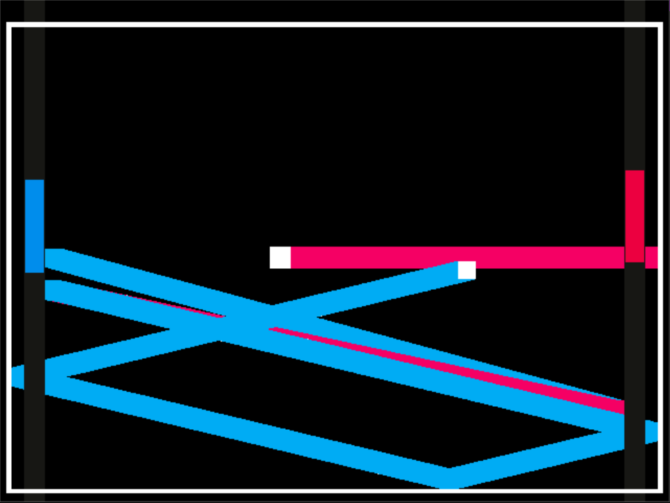

Turf Wars: 2D Edition

Author: Jiwoo

Design: In this game, you are a paddle facing off against another paddle in a
battle to see who can ink the most turf! The ball(s) you hit back and forth will mark your territory!

Screen Shot:

How To Play:

Use the mouse to move your paddle around.
The game will decide the winner when time runs out.
Ball(s) you hit back will convert their trailing ink to your color, and likewise
for the opponent.
If you are unable to hit the opponent's ball back, it will not change its trail color.

This game was built with [NEST](NEST.md).
